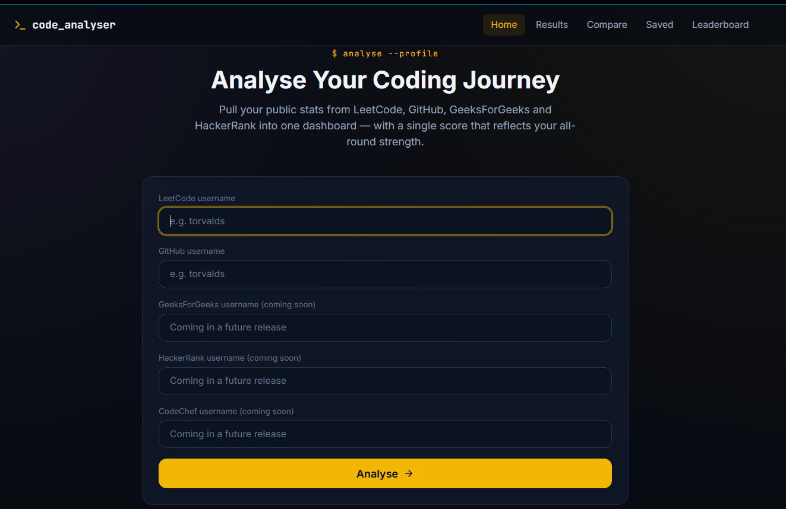
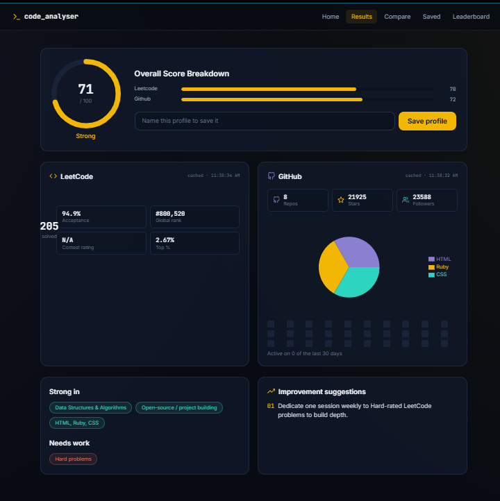

# 🧑‍💻 Coding Profile Analyser

A full-stack **MERN** application that pulls public coding stats from **LeetCode, GitHub, GeeksForGeeks, and HackerRank** into a single dashboard, with a weighted overall score, saved-profile comparisons, and a leaderboard.

---

## 🌐 Live Demo

- **Frontend:** [coding-analyser.vercel.app](https://coding-analyser.vercel.app)
- **Backend API:** [coding-analyser.onrender.com/api/health](https://coding-analyser.onrender.com/api/health)

> Note: the backend runs on Render's free tier, which spins down after inactivity — the **first** request after idle time can take 30–50 seconds to respond.

---

## 📸 Output

<p align="center">
  
</p>
<p align="center">
  
</p>

---

## ✨ Features

### 🏠 Home Page

- Username inputs for LeetCode and (GitHub, GeeksForGeeks, HackerRank, CodeChef reserved for a future release)
- Single "Analyse" button fetches all platforms in parallel
- Recent searches saved locally and re-runnable with one click

### 📊 Results Dashboard

- Animated circular **overall score gauge** (0–100), weighted 40% LeetCode / 30% GitHub / 20% GFG / 10% HackerRank
- **LeetCode card** — Easy/Medium/Hard donut chart, acceptance rate, global rank, contest rating, top percentile
- **GitHub card** — repo/star/follower counts, top-languages pie chart, a **real** contribution heatmap (scraped from GitHub's own public contribution calendar, not a fake approximation)
- **GeeksForGeeks card** — coding score, problems solved, institute rank, streak
- **HackerRank card** — badges and certifications
- Auto-derived **strengths, weaknesses, and improvement suggestions**
- Save any analysed profile with a custom name

### ⚖️ Compare Page

- Pick two saved profiles and see a category-by-category breakdown
- Per-category winner highlighted, plus an overall winner card

### 💾 Saved Profiles

- Grid of all saved profiles with a mini score gauge
- View or delete any saved profile

### 🏆 Leaderboard

- All saved profiles ranked by overall score
- Top 3 shown with gold/silver/bronze rank badges
- Per-platform ranking lists (LeetCode, GitHub)

### ⚙️ Reliability

- Every platform fetch is cached in-memory for 1 hour (`node-cache`) to avoid hammering source sites
- LeetCode has two data sources — the free community stats API, with automatic fallback to LeetCode's own GraphQL endpoint if the first is unavailable
- A single platform failing (GFG/HackerRank have no official public APIs) never blocks the other platforms' results

---

## 🛠 Tech Stack

| Layer    | Technology                                                                             |
| -------- | -------------------------------------------------------------------------------------- |
| Frontend | React 18, Vite, Tailwind CSS, React Router 6, Recharts, Framer Motion, React Hot Toast |
| Backend  | Node.js, Express, Mongoose, node-cache, Axios, Cheerio                                 |
| Database | MongoDB (Atlas in production, local MongoDB in development)                            |
| Hosting  | Vercel (frontend) · Render (backend) · MongoDB Atlas (database)                        |

---

## 📁 Folder Structure

```
coding-analyser/
├── server/
│   ├── config/
│   │   └── database.js            # Mongoose connection
│   ├── models/
│   │   ├── Profile.js
│   │   └── Search.js
│   ├── services/
│   │   ├── leetcodeService.js     # community API + GraphQL fallback
│   │   ├── githubService.js       # REST API + real contribution scrape
│   │   ├── gfgService.js          # unofficial API + HTML scrape fallback
│   │   ├── hackerrankService.js   # HTML scrape
│   │   └── scoreCalculator.js     # weighted overall score + insights
│   ├── controllers/
│   │   ├── analyseController.js
│   │   ├── profileController.js
│   │   └── statsController.js
│   ├── routes/
│   │   ├── analyseRoutes.js
│   │   ├── profileRoutes.js
│   │   └── statsRoutes.js
│   ├── middleware/
│   │   ├── errorHandler.js
│   │   └── cacheMiddleware.js
│   ├── server.js
│   └── .env.example
├── client/
│   ├── src/
│   │   ├── components/
│   │   │   ├── Platform/          # LeetCodeCard, GitHubCard, GFGCard, HackerRankCard
│   │   │   ├── Charts/            # DonutChart, LanguageChart, HeatMap
│   │   │   └── UI/                # ScoreGauge, StatBadge, LoadingSkeleton, ErrorCard, SuggestionCard
│   │   ├── pages/
│   │   │   ├── Home.jsx
│   │   │   ├── Results.jsx
│   │   │   ├── Compare.jsx
│   │   │   ├── SavedProfiles.jsx
│   │   │   └── Leaderboard.jsx
│   │   ├── hooks/
│   │   │   ├── useAnalyse.js
│   │   │   └── useProfile.js
│   │   ├── utils/
│   │   │   ├── api.js
│   │   │   ├── scoreCalculator.js
│   │   │   └── constants.js
│   │   ├── App.jsx
│   │   └── main.jsx
│   ├── vite.config.js
│   └── tailwind.config.js
├── docs/
│   ├── 1_requirements_gathering.txt
│   ├── 2_paper_design_wireframes.txt
│   ├── 3_sprint_plan.txt
│   ├── 4_manual_testing.txt
│   └── 5_deployment_guide.txt
└── README.md
```

---

## 🚀 Getting Started (Local)

### Prerequisites

- Node.js 18+
- MongoDB (local install, or a free MongoDB Atlas cluster)

### Backend

```bash
cd server
npm install
cp .env.example .env      # fill in MONGO_URI
npm run dev                # http://localhost:5000
```

### Frontend

```bash
cd client
npm install
npm run dev                # http://localhost:5173
```

The Vite dev server proxies `/api` requests to `http://localhost:5000`, so both must be running together for the app to work locally.

---

## 📦 Available Scripts

**server/**

| Command       | Description                          |
| ------------- | ------------------------------------ |
| `npm run dev` | Start with nodemon (auto-restart)    |
| `npm start`   | Start with plain node (used in prod) |

**client/**

| Command           | Description                          |
| ----------------- | ------------------------------------ |
| `npm run dev`     | Start the Vite dev server            |
| `npm run build`   | Build an optimized production bundle |
| `npm run preview` | Preview the production build locally |

---

## 🧩 Key Technical Concepts

### 1. Graceful degradation across 4 unreliable third-party sources

`analyseController.getAll()` fetches all 2 platforms in parallel with `Promise.all`, wrapping each in a `safeFetch()` that catches errors individually — one platform failing never breaks the response for the other three.

### 2. Two-tier LeetCode fetching

`leetcodeService.js` tries the free community stats API first (with retry + backoff), and falls back to querying LeetCode's own public GraphQL endpoint directly if that's unavailable — keeping the feature reliable despite depending on an unofficial free API.

### 3. Real GitHub contribution heatmap without auth

GitHub's REST API doesn't expose the contribution calendar without authenticated GraphQL access. Instead, `githubService.js` scrapes the same public HTML fragment GitHub itself renders at `/users/{username}/contributions`, reading each day's real `data-date` / `data-level` attributes.

### 4. In-memory caching

`cacheMiddleware.js` wraps every platform fetch with `node-cache`, keyed by `platform:username`, with a 1-hour TTL — avoiding repeated hits to rate-limited or scrape-sensitive external sites.

### 5. Weighted score engine

`scoreCalculator.js` normalizes each platform to a 0–100 sub-score, then combines them as `0.4×LeetCode + 0.3×GitHub + 0.2×GFG + 0.1×HackerRank`, and derives strengths/weaknesses/suggestions from that same breakdown.

---

## ⚠️ Known Limitations

- **GeeksForGeeks and HackerRank have no official public APIs.** This project uses an unofficial community API and HTML scraping as best-effort fallbacks, which may break if those sites change their markup or block automated requests.
- **LeetCode's free community stats API** is community-hosted and not guaranteed to always be available (mitigated with a GraphQL fallback).
- **GitHub's REST API** is rate-limited to 60 requests/hour without a personal access token.
- No authentication system — this version works with public usernames only.

---

## 🔮 Future Enhancements

- [ ] CodeChef integration (input field already reserved in the UI)
- [ ] User accounts / authentication
- [ ] Edit a saved profile after creation
- [ ] AI-generated personalized improvement plans (L2 extension)
- [ ] Historical score tracking over time (charts of progress)
- [ ] Export profile summary as a shareable image/PDF

---

## 📝 License

This project is open source and available under the [MIT License](LICENSE).

---

<p align="center">Built with ❤️ by Hruthik using the MERN stack</p>
